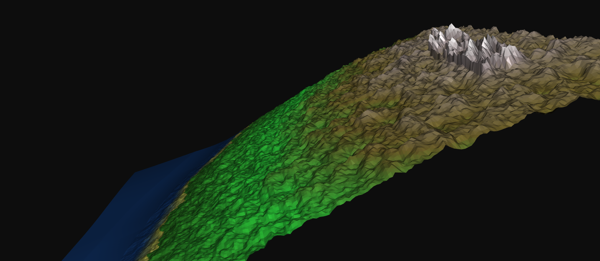
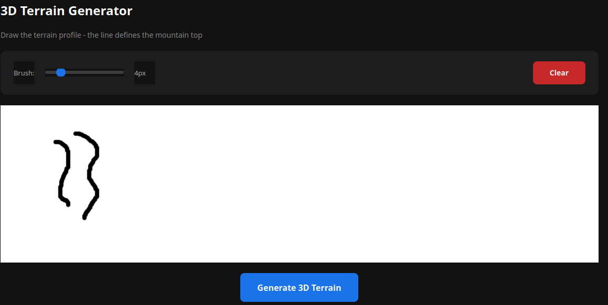
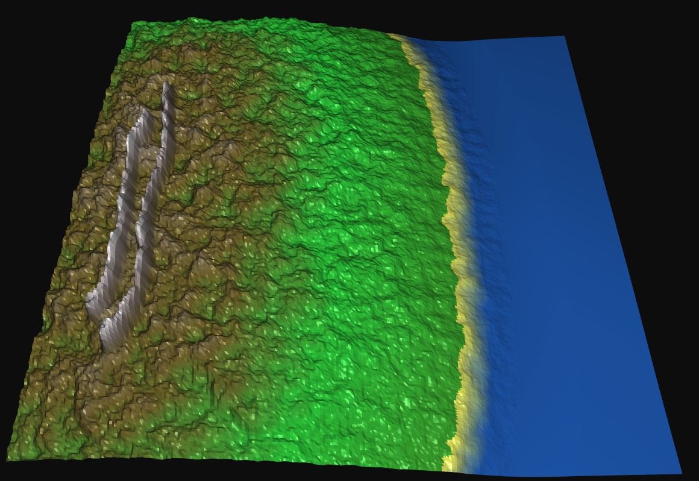
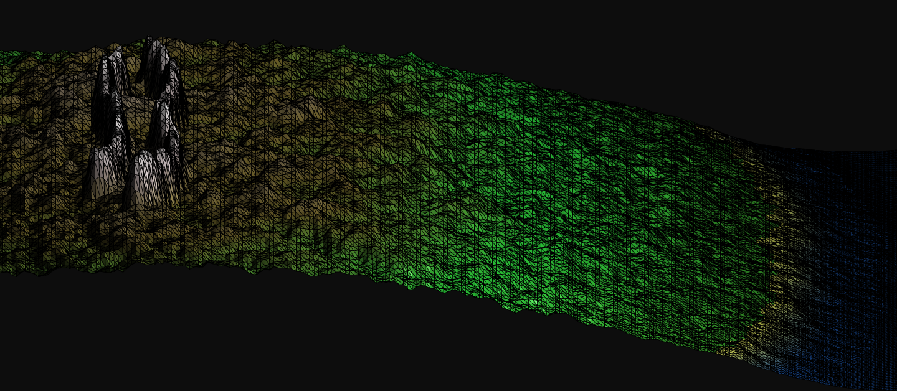

---

# 🏔️ cpp-terrain-project: Gerador de Terrenos 3D

[]()
[]()
[]()
[]()

<div align="center">
  
  <p><em>Transforme desenhos 2D em terrenos 3D detalhados</em></p>
</div>

📄 **Read this documentation in English:** [README.md](README.md)

---

## 📖 Visão Geral

O **cpp-terrain-project** é uma aplicação interativa em C++ que converte desenhos 2D em terrenos 3D detalhados, utilizando técnicas avançadas de computação gráfica e métodos numéricos.

O sistema combina processamento de imagens, reconstrução baseada em gradientes e geração de ruído procedural para criar paisagens realistas.

---

## 🎯 Objetivo e Principais Funcionalidades

| Funcionalidade                 | Descrição                                           |
| ------------------------------ | --------------------------------------------------- |
| **🎨 Desenho Interativo**      | Criação de perfis de terreno com pincel ajustável   |
| **📐 Extração de Gradientes**  | Uso do operador de Sobel para análise de gradientes |
| **🧮 Reconstrução de Poisson** | Resolução da equação de Poisson para superfícies 3D |
| **🌊 Ruído de Perlin**         | Geração de ruído procedural multi-octave            |
| **🎭 Visualização 3D**         | Renderização OpenGL em tempo real com Libigl        |
| **⚙️ Simulação de Erosão**     | Aplicação de erosão suave para maior realismo       |

---

## 📦 Bibliotecas Necessárias

| Biblioteca | Versão Mínima | Finalidade                                | Comando de Instalação            |
| ---------- | ------------- | ----------------------------------------- | -------------------------------- |
| Eigen3     | 3.4+          | Álgebra linear e solvers esparsos         | `sudo apt install libeigen3-dev` |
| OpenCV     | 4.5+          | Processamento de imagem e gradientes      | `sudo apt install libopencv-dev` |
| Qt6        | 6.0+          | Interface gráfica                         | `sudo apt install qt6-base-dev`  |
| Libigl     | Submódulo Git | Processamento e visualização de malhas 3D | Incluído via submódulo           |
| CMake      | 3.16+         | Sistema de build                          | `sudo apt install cmake`         |

---

## 📁 Estrutura do Projeto

```bash
cpp-terrain-project/
├── include/terrain-generator/
│   ├── TerrainGenerator.h
│   ├── ImageToGradient.h
│   ├── PerlinNoise.h
│   ├── ShowTerrain.h
│   ├── MainWindow.h
│   └── PaintWidget.h
├── src/
│   ├── core/
│   │   ├── TerrainGenerator.cpp
│   │   ├── ImageToGradient.cpp
│   │   └── PerlinNoise.cpp
│   └── gui/
│       ├── MainWindow.cpp
│       ├── ShowTerrain.cpp
│       └── PaintWidget.cpp
├── external/libigl/
├── docs/doxygen/
├── .github/workflows/
├── CMakeLists.txt
├── Doxyfile
├── main.cpp
├── README.md
└── README_BR.md
```

---

## 🖼️ Antes e Depois: Transformação Visual

### Entrada: Desenho 2D



### Saída: Terreno 3D



#### Com malha 3D



---

## 🎮 Controles da Aplicação

### 🖌 Interface de Desenho

| Controle                    | Ação                   | Descrição               |
| --------------------------- | ---------------------- | ----------------------- |
| Clique esquerdo + Arrastar  | Desenhar terreno       | Criação de montanhas    |
| Slider de Tamanho do Pincel | Ajustar espessura      | Intervalo de 1px a 20px |
| Botão Clear                 | Limpar tela            | Novo desenho            |
| Generate 3D Terrain         | Processar e visualizar | Abre o visualizador 3D  |

---

### 🧊 Controles do Visualizador 3D (Libigl)

| Tecla / Controle | Ação            | Efeito                    |
| ---------------- | --------------- | ------------------------- |
| Arrastar mouse   | Rotacionar cena | Orbitar terreno           |
| Scroll           | Zoom            | Aproximar / afastar       |
| Shift + Arrastar | Pan             | Mover câmera              |
| L, l             | Wireframe       | Alternar modo             |
| F, f             | Faces           | Alternar renderização     |
| O, o             | Projeção        | Ortográfica / Perspectiva |
| S, s             | Sombras         | Iluminação                |
| T, t             | Preenchimento   | Faces sólidas/transp.     |
| Z                | Reset           | Câmera padrão             |
| [ , ]            | Modo rotação    | Tipo de controle          |
| < , >            | Modelo          | Alternar modelos          |
| ESC              | Sair            | Fechar aplicação          |

---

## 🧩 Compilação a partir do Código-Fonte

### 🛠️ Passos de Compilação

#### 1️⃣ Clonar o Repositório

```bash
git clone --recursive https://github.com/PedroKeita/cpp-terrain-project.git
cd cpp-terrain-project
```

#### 2️⃣ Configurar o Build

```bash
mkdir build
cd build
cmake .. -DCMAKE_BUILD_TYPE=Release
```

#### 3️⃣ Compilar

```bash
make -j$(nproc)
```

#### 4️⃣ Executar

```bash
./cpp-terrain-project
```

---

## 📓 Documentação

### 📚 Referência da API

Documentação gerada automaticamente:
[https://pedrokeita.github.io/cpp-terrain-project/](https://pedrokeita.github.io/cpp-terrain-project/)

### 🔧 Gerar Documentação Localmente

```bash
sudo apt install doxygen graphviz
doxygen Doxyfile
xdg-open docs/doxygen/html/index.html
```
---


